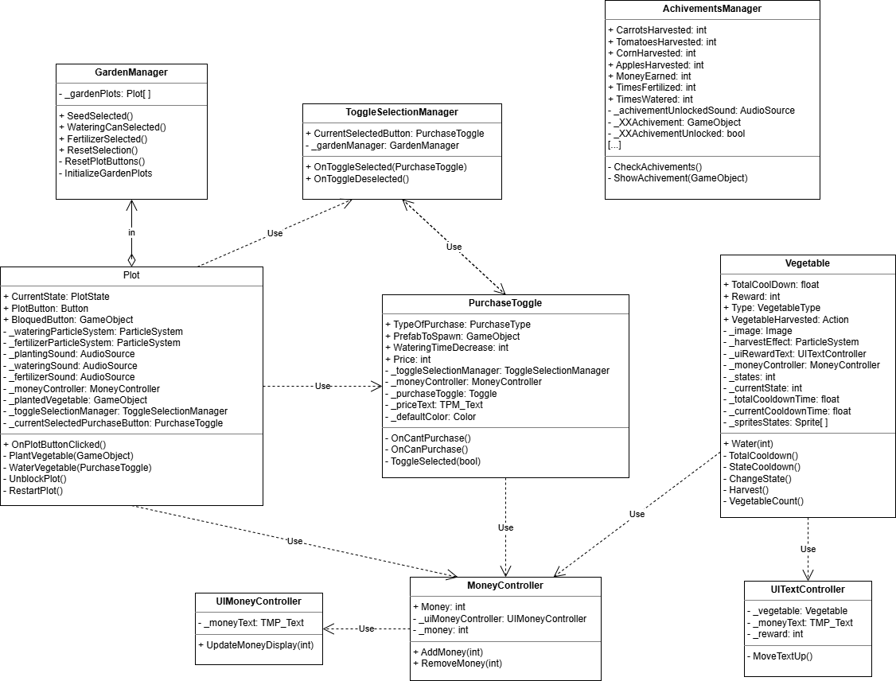

# MobileFarm
Este proyecto es un juego para Android inspirado la huerta de una granja, una cuadrícula donde en cada parcela se pueden plantar hortalizas (zanahorias, tomates, maíz y manzanas) y ganar monedas al cosecharlas.
## Gameplay
Hay un total de 54 parcelas. Al iniciar hay 9 libres y 45 bloqueadas. A lo largo del juego estas parcelas podrán ser desbloqueadas.   
  
El jugador comienza con la cantidad de 2 monedas. Puede usar las monedas para comprar las semillas que seleccione y plantarlas en una parcela libre.  
  
Las hortalizas tienen ciertos estados cada una, desde que se plantan hasta que están listas para ser recogidas. Tardarán cierto tiempo en cambiar de estado, dependiendo de qué planta sea. Por ejemplo las más caras tardan más tiempo, pero dan mayores recompensas.  
  
Cuando la hortaliza está lista para ser cosechada el jugador podrá clickar sobre ella, y automáticamente ganará cierta cantidad de monedas (dependiendo del tipo de hortaliza). La parcela quedará vacía de nuevo, lista para volver a plantar.  
  
Si se usan 2 monedas se podrá usar la regadera. Cada vez que se usa este objeto sobre una hortaliza el tiempo de espera para ser cosechada se reducirá 4 segundos.  

Si se usan 100 monedas se podrá usar el fertilizante. Se usa sobre una parcela bloqueada para desbloquearla, quedando libre para plantar nuevas hortalizas.  
### Resumen  
Hortaliza | Tiempo de espera | Precio | Recompensa |
:---: | :---: | :---: | :---: |
Zanahoria | 8s | 2 | 3 |
Tomates | 12s | 4 | 8 |
Maíz | 18s | 10 | 15 |
Manzanas | 28s | 20 | 30 |

Objeto | Precio | Efecto |
:---: | :---: | :---: |
Regadera | 2 | Reduce el tiempo de espera de la hortaliza en 4 segundos |
Fertilizante | 100 | Desbloquea una parcela para habilitarla |

## UML
  

## Assets
### Sprites  
Arte de la granja ([Asset store](https://assetstore.unity.com/packages/2d/characters/basic-pixel-farm-asset-pack-64192))  
UI ([Asset store](https://assetstore.unity.com/packages/2d/gui/farm-game-ui-starter-2d-318607))  
  
### Audio  
Música de fondo ([Freesound](https://freesound.org/people/WakuWakuWakuWaku/sounds/423135/))  
Plantar ([Freesound](https://freesound.org/people/renandosanjos/sounds/854621/))  
Recompensa ([Freesound](https://freesound.org/people/Anthousai/sounds/336585/))  
Regadera ([Freesound](https://freesound.org/people/wobesound/sounds/488401/))  
Fertilizante ([Freesound](https://freesound.org/people/Ali_6868/sounds/384361/))  
Logro ([Freesound](https://freesound.org/people/djlprojects/sounds/413629/))  

